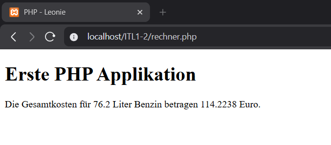
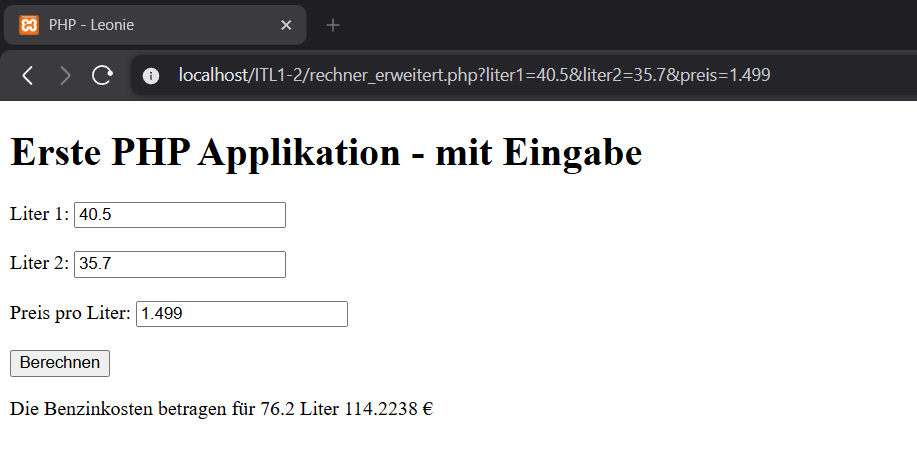

# Erste PHP Applikation

Author: Leonie Rüger
LBS Eibiswald | 3aAPC

## Fragen

phpinfo(); - aktuelle PHP version, Compiler, System, welcher Server und viele weitere Infos

display_errors - Wenn aktiviert werden Errors im Browser direkt angezeigt wenn es aus ist werden keine angezeigt

memory_limit - legt fest wie viel ram ein php script maximal verwenden darf

max_execution_time - gibt an wie viele Sekunden lang ein Skript laufen darf

allow_url_fopen = off - wenn off dürfen gewissen funktionen nicht externe datein öffnen/laden nur lokale

session.auto_start = off - wenn off ist startet php nicht automatisch beim aufrufen der Seite eine Session

## rechner.php

Erstmal die HTML Grundlage erstellen lassen und den Titel angepasst zu "PHP - Leonie"

Ich habe auch eine Überschrift für die Seite erstellt

Dann habe ich den PHP Bereich definiert und die Variablen mit den festen Werten aus der Aufgabenstellung initialisiert und definiert

Als nächstes die Variable für die ausgerechnetten Kosten erstellt bei welcher wie bei der Aufgabe gewollt 

Dann einfach die Ausgabe außerhalb vom PHP Code in einen p bei welchen die Daten per echos ausgegeben werden

## rechner_erweitert.php

Ich habe die rechner.php kopiert und die Grundstuktur für das Form und php waren vom eduvidual kurs

Ich habe für alle Werte einen Standardwert erstellt

Mit einen if wird überprüft ob die Werte auch vom Formular kommen
dann wird für alles die Werte ausgelesen welche vom Formular kommen und in float umgewandelt

Wie davor wird der Preis gleich berechnet und das gleiche mit den Satz für die Ausgabe

Im letzen php Bereich wird die Ausgabe nur dann ausgegeben nachdem man auf Berechnet gedrückt hat und wenn die kosten berechnet wurden bzw. nicht null sind 

## Öffnen

Einfach nachdem XAMPP mit Apache und MySQL an sind einfach "http://localhost/ITL1-2/rechner.php" oder http://localhost/ITL1-2/rechner_erweitert.php" im Browser einfügen

## Screenshots

